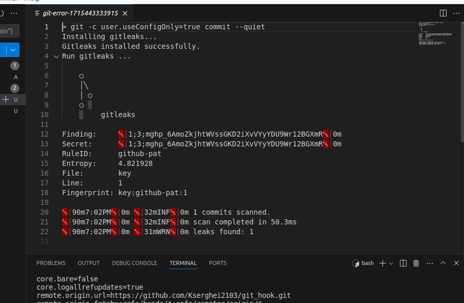

# Gitleaks pre-commit hook

### Installation:

copy pre-commit file to [your git project]/.git/hooks folder

  cd [your project folder]

  curl -sSfL -o .git/hooks/pre-commit https://raw.githubusercontent.com/Kserghei2103/gitleaks-pre-commit-hook/main/pre-commit%20%20

set exec permissions

  chmod +x ./.git/hooks/pre-commit 

enable the hook with git config

  git config hooks.gitleaks true

Usage
try to commit a sensetive data 

Exemple:

